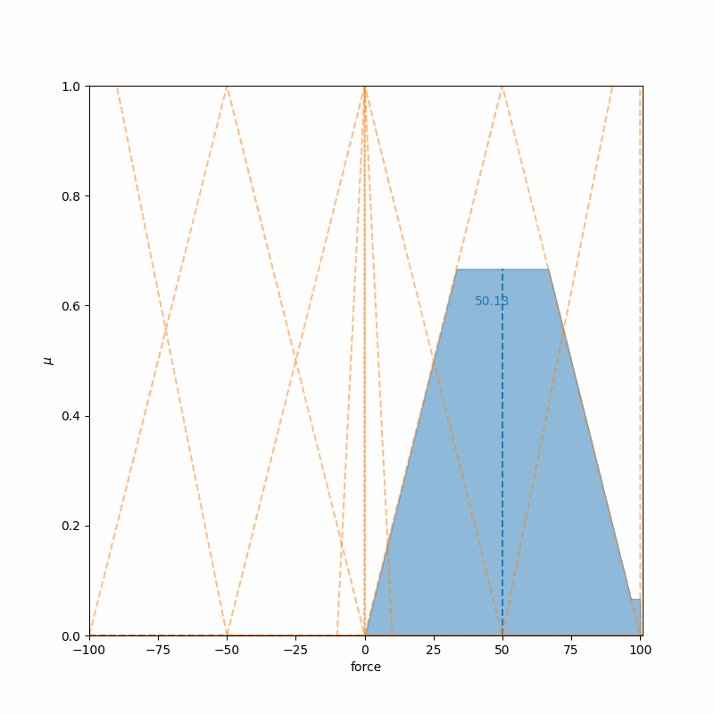

# Fuzzy Inference System
This repository contains a generic implementation of a Fuzzy Inference System (FIS) in Python.

# Inverted Pendulum Control
The `main.py` file contains a sample usage of the FIS, where the inverted pendulum problem is solved
using fuzzy control.

## Membership functions

## Results
|          test          |         test 2          |
|:----------------------:|:-----------------------:|
|  |  |